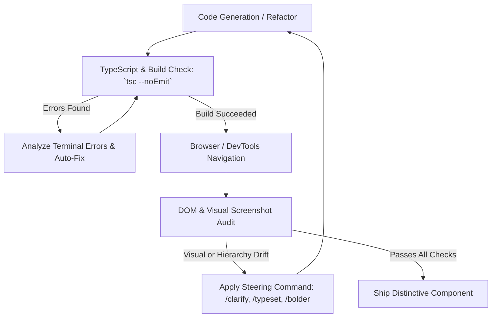

# Autonomous UI Verification & Defensive Engineering Skill

This skill guides the agent in closing the verification loop, preventing silent UI failures, and ensuring that generated code compiles cleanly, runs securely, and visually aligns with the intended design.

---

## 1. The Autonomous Verification Loop

Never output code and assume it works without verification. Follow this 4-step loop:



---

## 2. Defensive Component Engineering

To prevent an experimental or AI-generated subcomponent from crashing the entire application, wrap components in defensive boundaries:

### React Error Boundaries
```tsx
"use client";

import React, { Component, ErrorInfo, ReactNode } from "react";

interface Props {
  fallback?: ReactNode;
  children: ReactNode;
}

interface State {
  hasError: boolean;
  error?: Error;
}

export class SafeComponentBoundary extends Component<Props, State> {
  public state: State = { hasError: false };

  public static getDerivedStateFromError(error: Error): State {
    return { hasError: true, error };
  }

  public componentDidCatch(error: Error, errorInfo: ErrorInfo) {
    console.error("Agentic Component Error Caught:", error, errorInfo);
  }

  public render() {
    if (this.state.hasError) {
      return (
        this.props.fallback || (
          <div className="p-4 rounded-xl border border-sevvaanam/30 bg-sevvaanam/10 text-sevvaanam text-xs font-mono">
            <span>Component temporarily unavailable.</span>
          </div>
        )
      );
    }
    return this.props.children;
  }
}
```

### Exhaustive TypeScript Pattern Matching
Prevent silent failures when branching on state or variants by using TypeScript's `never` type:

```tsx
type TinaiLandscape = "kurinji" | "mullai" | "marutham" | "neithal" | "paalai";

function getLandscapeAccent(tinai: TinaiLandscape): string {
  switch (tinai) {
    case "kurinji":
      return "var(--color-kurinji)";
    case "mullai":
      return "var(--color-olai)";
    case "marutham":
      return "var(--color-manjal)";
    case "neithal":
      return "var(--color-mayil)";
    case "paalai":
      return "var(--color-mann)";
    default: {
      const _exhaustive: never = tinai;
      throw new Error(`Unhandled landscape: ${_exhaustive}`);
    }
  }
}
```

---

## 3. Visual & Accessibility Verification Checklist

Before completing any UI task:
1. **Compilation**: Run `npx tsc --noEmit` to guarantee 0 TypeScript errors.
2. **Browser Verification**: Use the browser subagent or live DevTools to navigate to `http://localhost:3000/<route>`.
3. **Screenshot Audit**: Verify visual balance, absence of horizontal scrollbar overflow (`overflow-x`), and correct typographic hierarchy.
4. **Keyboard & Focus States**: Confirm all `<button>`, `<a>`, and `<input>` elements have visible focus indicators (`focus-visible:ring-2`).
5. **Reduced Motion**: Verify that animations degrade gracefully when `prefers-reduced-motion: reduce` is active.
