# Project Aintinai (ஐந்திணை) — Official Design System

This document specifies the design tokens and architectural constraints for the OSU Tamil Sangam digital presence, adhering to the **W3C Design Tokens Community Group (DTCG)** three-tier hierarchy and **perceptually uniform OKLCH color spaces** rooted in the **official OSU Tamil Sangam emblem**: Royal Purple, Electric Mint Teal 3D extrusion, Soft Lilac Tamil watermark, and Warm Ivory typography.

---

## 1. Three-Tier Token Architecture

```mermaid
flowchart LR
    subgraph Primitive["Tier 1: Primitive Tokens"]
        P1["oklch(0.38 0.22 305) - Sangam Royal Purple (#4c2472)"]
        P2["oklch(0.78 0.16 168) - Electric Mint Teal (#55CCA2)"]
        P3["oklch(0.86 0.09 300) - Watermark Lilac (#e9d5ff)"]
        P4["oklch(0.98 0.015 85) - Warm Ivory (#fffdf9)"]
        P5["oklch(0.82 0.18 85) - Solar Gold (#f59e0b)"]
    end
    subgraph Semantic["Tier 2: Semantic Tokens"]
        S1["--color-action-primary"]
        S2["--color-surface-base"]
        S3["--color-border-mint"]
    end
    subgraph Component["Tier 3: Component Tokens"]
        C1["--button-primary-bg"]
        C2["--card-surface-bg"]
        C3["--logo-mint-shadow"]
    end
    Primitive --> Semantic --> Component
```

---

## 2. OKLCH Color Space: Official Logo & Festive Dravidian Palette

All palette colors are defined in native, perceptually uniform **OKLCH**, ensuring equal luminance steps and vibrant collegiate energy.

### Core Pigment Palette (Primitives)

| Token Name | Cultural Name | OKLCH Value | Role & Character |
| :--- | :--- | :--- | :--- |
| `--color-sangam-purple` | அரச ஊதா (Royal Violet) | `oklch(0.38 0.22 305)` | **Official emblem background**; rich regal purple (`#4c2472`) |
| `--color-sangam-mint` | மரகதம் / புதினா (Mint Teal) | `oklch(0.78 0.16 168)` | **Signature 3D text shadow**; electric seafoam (`#55CCA2`) |
| `--color-sangam-lilac` | நீலாம்பரி (Soft Lilac) | `oklch(0.86 0.09 300)` | **Repeating Tamil script watermark** (`#e9d5ff`) |
| `--color-sangam-cream` | வெண்முத்து (Warm Ivory) | `oklch(0.98 0.015 85)` | **Main lettering fill**; crisp ivory white (`#fffdf9`) |
| `--color-sangam-gold` | பொன்மஞ்சள் (Solar Gold) | `oklch(0.82 0.18 85)` | Harvest radiance, festive Pongal celebration (`#f59e0b`) |
| `--color-sangam-coral` | குங்குமச் சிவப்பு (Kumkumam Coral) | `oklch(0.62 0.22 25)` | Energetic dance accents, celebration red (`#f43f5e`) |

### The Five Landscape Themes (ஐந்திணை)

Each landscape dynamically re-tints the semantic layer:

1. **மருதம் (Marutham — Plains & Assembly)**
   - *Primary Accent*: `--color-temple-bronze` (`oklch(0.68 0.16 85)`)
   - *Secondary*: `--color-olai-green` (`oklch(0.60 0.12 135)`)
   - *Sky Gradient*: `linear-gradient(180deg, oklch(0.14 0.02 60) 0%, oklch(0.18 0.03 80) 50%, oklch(0.24 0.05 90) 100%)`

2. **நெய்தல் (Neithal — Seashore & Estuaries)**
   - *Primary Accent*: `--color-mayil-teal` (`oklch(0.52 0.14 195)`)
   - *Secondary*: `--color-kumkumam-crimson` (`oklch(0.55 0.22 28)`)
   - *Sky Gradient*: `linear-gradient(180deg, oklch(0.12 0.03 240) 0%, oklch(0.20 0.06 250) 60%, oklch(0.28 0.08 260) 100%)`

3. **முல்லை (Mullai — Forest & Jasmine Groves)**
   - *Primary Accent*: `--color-olai-green` (`oklch(0.60 0.12 135)`)
   - *Secondary*: `--color-temple-bronze` (`oklch(0.68 0.16 85)`)
   - *Sky Gradient*: `linear-gradient(180deg, oklch(0.12 0.02 140) 0%, oklch(0.18 0.04 145) 60%, oklch(0.24 0.05 135) 100%)`

4. **பாலை (Paalai — Sun-Drenched Earth & Journey)**
   - *Primary Accent*: `--color-terracotta` (`oklch(0.48 0.18 38)`)
   - *Secondary*: `--color-temple-bronze` (`oklch(0.68 0.16 85)`)
   - *Sky Gradient*: `linear-gradient(180deg, oklch(0.14 0.03 38) 0%, oklch(0.20 0.05 40) 60%, oklch(0.26 0.06 42) 100%)`

5. **குறிஞ்சி (Kurinji — High Mountain Neelakurinji Bloom)**
   - *Primary Accent*: `oklch(0.62 0.18 290)` (Neelakurinji Violet)
   - *Secondary*: `--color-neeli-midnight` (`oklch(0.24 0.09 265)`)
   - *Sky Gradient*: `linear-gradient(180deg, oklch(0.12 0.03 280) 0%, oklch(0.18 0.05 285) 60%, oklch(0.24 0.07 290) 100%)`

---

## 3. Typography Hierarchy: Clash Display & Mukta Malar

- **Display Headings (English / Latin)**: `Clash Display` (`var(--font-display)`)
  - Expressive geometric authority, high character, wide stance.
  - Tight line heights (`leading-[1.05–1.15]`), optical tracking.
- **Body & Authentic Tamil Typography**: `Mukta Malar` (`var(--font-body)` / `var(--font-tamil)`)
  - Crafted specifically for classical and modern Tamil scripts; zero character clipping.
  - Generous line height on Tamil: `leading-[1.72]`, `letter-spacing: 0`.
- **Monospace & Metadata**: `JetBrains Mono` (`var(--font-mono)`)

---

## 4. Motion Tokens & Physics Parameters

| Animation Type | Engine | Parameters | Usage |
| :--- | :--- | :--- | :--- |
| **Direct Interaction (Tilt/Hover/Pull)** | Spring | `stiffness: 350, damping: 28` | 3D card tilt, button magnetism |
| **Modal / Lightbox Morph** | Framer Motion | `layout`, `layoutId` | Shared element card to lightbox morph |
| **List Sequencing** | Variant | `staggerChildren: 0.07s, delayChildren: 0.1s` | Board roster, event timeline, gallery |
| **Systemic Route Fades** | Tween | `duration: 0.35s, ease: [0.16, 1, 0.3, 1]` | Route transition and modal backdrop |
